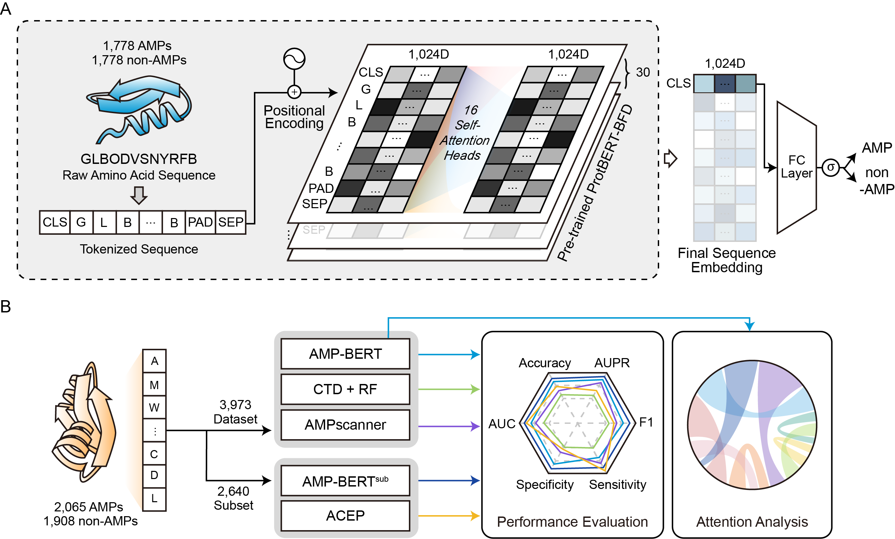

# AMP-BERT: Prediction of Antimicrobial Peptide Function Based on a BERT Model

## Abstract
Antimicrobial resistance is a growing health concern. Antimicrobial peptides (AMPs) disrupt harmful microorganisms by non-specific mechanisms, making it difficult for microbes to develop resistance. Accordingly, they are promising alternatives to traditional antimicrobial drugs. In this study, we developed an improved AMP classification model, called AMP-BERT. We propose a deep learning model with a fine-tuned BERT architecture designed to extract structural/functional information from input peptides and identify each input as AMP or non-AMP. We compared the performance of our proposed model and other machine learning-based and deep learning-based methods. Our model, AMP-BERT, yielded the best prediction results among all models evaluated with our curated external dataset. In addition, we utilized the attention mechanism in BERT to implement an interpretable feature analysis and determine the specific residues in known AMPs that contribute to peptide structure and antimicrobial function. The results show that AMP-BERT can capture the structural properties of peptides for model learning, enabling the prediction of AMPs or non-AMPs from input sequences. AMP-BERT is expected to contribute to the identification of candidate AMPs for functional validation and drug development.

## Fine-Tuning and Model Implementation with Colab
The fine-tuned AMP-BERT model can be reproduced and implemented for the AMP prediction downstream task in this [Colab notebook](https://colab.research.google.com/drive/174Qh22KCga8E4EiJ9fc8AUAbsQzOP11b?usp=sharing).

The pre-trained model is based on ProtBERT-BFD from [Elnaggar et al., 2021](https://doi.org/10.1109/TPAMI.2021.3095381).

## License
AMP-BERT follows [GPL 3.0v license](https://github.com/GIST-CSBL/AMP-BERT/blob/main/LICENSE). Therefore, AMP-BERT is open source and free to use for everyone.

## Contact
Hansol Lee (hansol.lee@gist.ac.kr)

Hojung Nam* (hjnam@gist.ac.kr)

*Corresponding Author

## Model Overview

